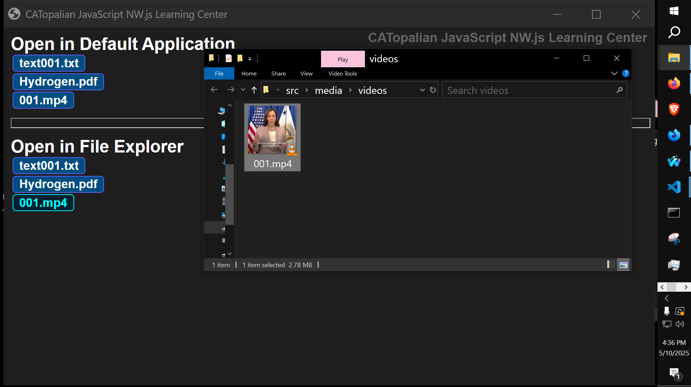

# CATopalian NWJS Learning Center
A JavaScript NW.js Node.js application that allows us to make a desktop application using HTML, CSS, JS, and Node.js, that opens files in their native applications or shows them in File Explorer on Windows for easy editing.

REQUIREMENTS:
* Node.js https://nodejs.org/en

* NW.js https://nwjs.io/  

---

---

To run this application we:
* Download NW.js
* Extract All
* Find the nw.exe icon
* Drag the folder named app onto the nw.exe icon  

Full Instructions on Running our app here: https://github.com/ChristopherAndrewTopalian/CATopalian_JavaScript_NW.js

---

### How to Download this App
1. Click the green Code Button on this github page
2. Choose Download ZIP
3. Save the Zip File
4. Extract All
5. Drag the folder named app onto the nw.exe icon 

---

Happy Scripting :-)

---

//----//  

// Dedicated to God the Father  
// All Rights Reserved Christopher Andrew Topalian Copyright 2000-2026  
// https://github.com/ChristopherTopalian  
// https://github.com/ChristopherAndrewTopalian  
// https://sites.google.com/view/CollegeOfScripting

